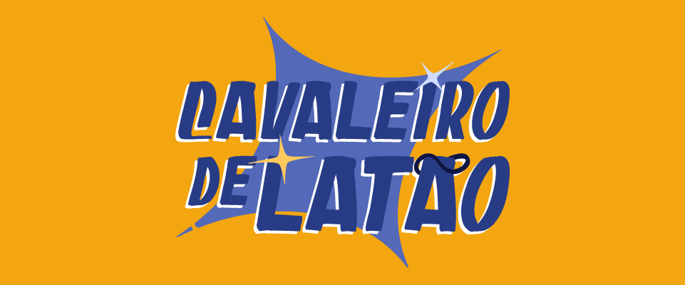

[Link para Jogar](https://itch.io/embed-upload/10756023?color=F3A610)

<iframe src="https://itch.io/embed-upload/10756023?color=F3A610" width="640" height="380"><a href="https://pipoodid.itch.io/cavaleiro-de-latao">Play Cavaleiro de Latão on itch.io</a></iframe>

# Projeto Cavaleiro
> Aqui está uma fração do meu Projeto de conclusão de curso. Onde eu desenvolvo um jogo que irá contar a história autoral.

Veja as etapas desse projeto aqui:

[Roadmap](ROADMAP.md)

## 📝 Licença

Esse projeto está sob licença. Veja o arquivo [LICENÇA](LICENSE.md) para mais detalhes.

<a property="dct:title" rel="cc :attributionURL" href="https://github.com/FilipeVDuarte/ProjetoCavaleiro">Cavaleiro de Latão</a> de Filipe Duarte está licenciado sob <a href= "https://creativecommons.org/licenses/by-nc-nd/4.0/?ref=chooser-v1" target="_blank" rel="license noopener noreferrer" style="display:inline-block;">CC BY-NC-ND 4.0</a>

